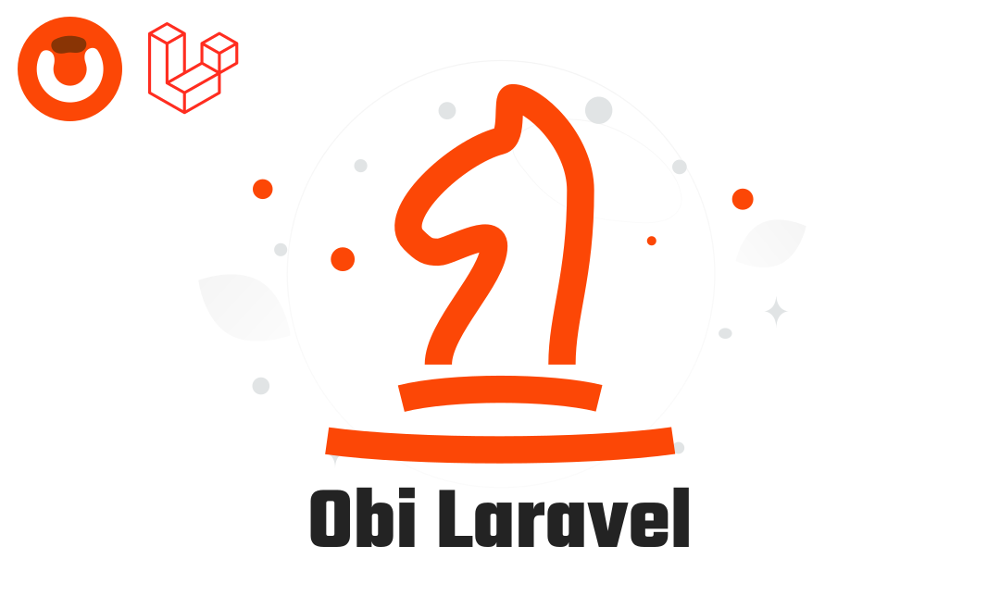

# Obi Laravel

<div align="center">



[](https://packagist.org/packages/obelaw/obi-laravel)
[](https://packagist.org/packages/obelaw/obi-laravel)
[](https://devdocs.obelaw.com/packages/obi-laravel)

</div>

Obi is a Laravel package that integrates Google's Gemini function-calling with your app. Define declarations (tools) that describe callable functions, map them to your classes/methods, and let Gemini decide when to call them during a conversation.

## Features

- Gemini function calling made simple
- Declaration files with typed parameter schemas
- Multiple declaration pools (module-friendly)
- Database-backed registry of declarations
- Handy Artisan commands to make/list/build
- Simple facade: `Obi::prompt('...')`
- Optional tagging and caching

## Installation

Install via Composer:

```bash
composer require obelaw/obi-laravel
```

Publish config (optional):

```bash
php artisan vendor:publish --tag=obi-config
```

Run migrations:

```bash
php artisan migrate
```

## Configuration

Set environment variables in your `.env`:

```env
GEMINI_API_KEY=your_api_key_here
GEMINI_MODEL=gemini-2.5-flash
OBI_CACHE_ENABLED=true
OBI_CACHE_TTL=3600
OBI_CACHE_PREFIX=obi
OBI_LOGGING_ENABLED=false
OBI_LOG_CHANNEL=stack
```

You can also configure declaration pools in `config/obi.php`:

```php
'declaration_pools' => [
  base_path('declarations'),
  // base_path('modules/orders/declarations'),
],
```

## Quick start

1. Make a new declaration (you'll be prompted to pick a pool):

```bash
php artisan declaration:make GetOrderCount
```

1. Open the generated file and adjust parameters/targets, for example:

```php
<?php

use Gemini\Data\FunctionDeclaration;
use Gemini\Data\Schema;
use Gemini\Enums\DataType;
use Obelaw\Obi\Declaration;

return new class extends Declaration
{
  public ?string $tag = 'orders';

  public function declaration(): FunctionDeclaration
  {
    return new FunctionDeclaration(
      name: 'getOrderCount',
      description: 'Gets the count of orders by status.',
      parameters: new Schema(
        type: DataType::OBJECT,
        properties: [
          'status' => new Schema(
            type: DataType::STRING,
            description: 'The order status (pending, completed, cancelled)'
          ),
        ],
        required: ['status']
      )
    );
  }

  public function targetClass(): string
  {
    return \App\Services\OrderService::class;
  }

  public function targetMethod(): string
  {
    return 'getOrderCount';
  }
};
```

1. Build the registry from pools into the database:

```bash
php artisan declaration:build
```

1. (Optional) List discovered declarations from pools:

```bash
php artisan obi:declaration:list
```

1. Ask Gemini via the facade:

```php
use Obelaw\Obi\Facades\Obi;

$reply = Obi::prompt('How many pending orders do we have?');
```

## Obi as an engine

Obi acts as an engine between Gemini's function-calling and your Laravel code. It discovers tools (declarations), describes their parameter schemas, exposes them to the model, and routes function calls back to your application.

What the engine does:

- Discovers declaration files from configured pools
- Builds a registry in the database for fast lookup
- Exposes all function schemas to Gemini at prompt time
- Resolves and executes the mapped target class/method when Gemini calls a function

Data flow in 5 steps:

1. You write declaration files that return an anonymous class extending `Obelaw\\Obi\\Declaration`.
1. `php artisan declaration:build` scans pools and stores records in `obi_declarations` (file, function_name, function_description, declaration schema, target_class, target_method, tag, enabled).
1. `GeminiService` loads function schemas from the registry and starts a chat with tools.
1. When the model issues a function call, Obi resolves the corresponding target class/method and executes it with provided args.
1. The function result is sent back to the model to produce the final response.

Minimal declaration contract:

```php
use Obelaw\\Obi\\Declaration;
use Gemini\\Data\\FunctionDeclaration;

abstract class Declaration
{
  public ?string $tag = null; // optional grouping

  abstract public function declaration(): FunctionDeclaration; // schema + name
  abstract public function targetClass(): string;              // FQCN
  abstract public function targetMethod(): string;             // method name
}
```

Extensibility notes:

- Multiple pools let you organize tools by module or package
- Tags allow selective building/listing (`--tag=...`)
- Caching knobs (`OBI_CACHE_*`) to speed up repeated calls

## Commands

- `declaration:make {name}` — Scaffold a new declaration file (prompts for pool)
- `declaration:build` — Parse pools and store declarations in DB
- `obi:declaration:list` — Show declarations found in pools

## Declaration pools

Pools are directories that contain your declaration files. Configure them in `config/obi.php` or add at runtime via the service provider. The maker command will prompt you to choose among configured pools.

## Facade

The package registers an `Obi` facade. You can also bind an alias in your app config if desired.

## Troubleshooting

- Missing API key: ensure `GEMINI_API_KEY` is set.
- No declarations listed: verify your pools in `config/obi.php` and that files return an instance extending `Obelaw\\Obi\\Declaration`.
- Build errors about serialization: the package stores a serializable representation of the function schema and mapping; re-run `declaration:build` after editing files.

## License

MIT
